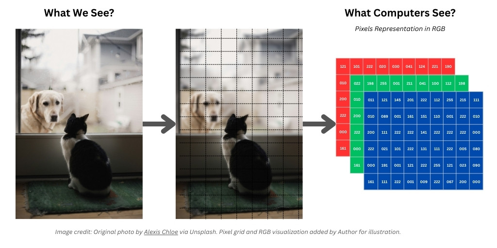

## 🧠 GenAI Byte CNN #1: Teaching Machines to See! 👀

👋 Let's kick off our new series on **Computer Vision (CV)** – teaching machines to understand the visual world!

**What's the Goal?**
For us, seeing is effortless! We recognize faces, navigate streets, understand scenes instantly. CV aims to give computers a similar superpower: "to know **what** is **where** by looking," just using raw visual input. (Inspired by MIT 6.S191!)

**How Computers "See" - It's All Numbers!**
Here’s the key difference: We see objects, textures, and scenes. Computers see… **numbers!**

- **Analogy Time!** 🎨 Imagine a super-detailed **Paint-by-Numbers** picture.
    - *We* look at the finished piece and see a cat or a dog.
    - The *computer*, however, looks at the same picture but only sees the underlying grid, reading the **original number** printed in each tiny square (pixel). It doesn't inherently see "cat," it sees "pixel #1 has RGB values (121, 010, 200), pixel #2 has..."
- **The Pixel Grid:**
    - Every image is just a grid of **pixels**.
    - **Grayscale Image:** A 2D grid (like a spreadsheet) where each cell (pixel) has *one* number (0=black, 255=white).
    - **Color Image (RGB):** A 3D grid (like 3 spreadsheets stacked) – Height x Width x 3. Each pixel has *three* numbers representing Red, Green, and Blue intensity.

**Why Numbers? Common Vision Tasks:**
This numerical representation allows machines to perform tasks like:

- **Classification:** "Looking" at the number patterns and deciding: Is this grid of numbers a "cat" or a "dog"?
- **Regression:** Predicting a continuous value from the numbers, like the exact angle of a car's steering wheel from road imagery.

**Key Takeaway:** Computer Vision starts by representing images as structured grids of numerical pixel values (2D/3D). Learning patterns in these numbers is how machines begin to "see".

🔗  [Watch this video](https://drive.google.com/file/d/1ArmlcZsnHVEj6uYp4YsyxOrL2TckH6_N/view?usp=share_link)

Next up: If it's just numbers, why is vision so easy for us but incredibly challenging for computers? 🤔 Stay tuned!