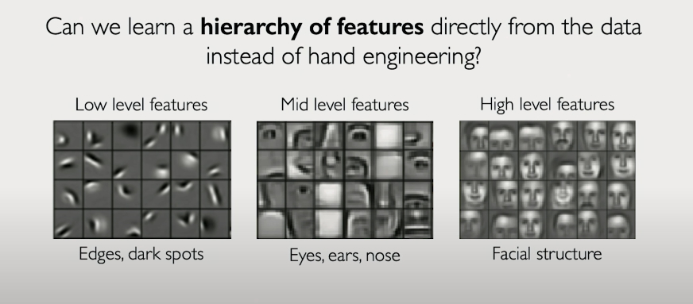

**🧠 GenAI Byte #2: Why is Vision Hard for Computers? 🤯**

Yesterday, we looked at images as collections of numbers. Easy for computers, right? Think again! While *we* instantly recognize a "cat," computers struggle. The culprit? **Variability – it's like an endless array of disguises!**

Imagine training a **rookie detective** (a computer) to recognize a "suspect" (a cat):

* **The Problem: Many Disguises!**  
  The "suspect" can appear in countless disguises:
    * **Viewpoint Disguise:** Seen from the front, side, back, or above?
    * **Scale Disguise:** Close-up, far away, tiny, or huge?
    * **Lighting Disguise:** Under bright sun, in dim shadows, or with night vision?
    * **Pose Disguise:** Sitting, stretching, curled up, or mid-jump?
    * **Partial Disguise (Occlusion):** Hidden behind furniture or peeking out from a box?
    * **Background Disguise:** Blending into similarly colored carpet or standing out on white snow?

**(Think of James Bond in various scenes – same person, different looks and environments!)**

- **Rookie Detective's Mistake:**  
  A rookie might focus solely on surface details – "suspect has brown fur in this photo, so must always have brown fur!" This method falls short, getting easily fooled by a black cat or one in shadow. *Pixel-by-pixel comparison is just like that rookie error!*

- **Trained Detective's Skill (Feature Extraction):**  
  A seasoned detective looks for **key features** that remain constant despite disguises:
    * For a cat: pointy ears, whiskers, a unique eye shape, and a characteristic tail length.
    * For a face: consistent eye spacing, a defined nose shape, and typical mouth positioning.
    
   
    
    These robust features serve as the **real clues** to identify the "suspect" even when appearances change.

- **Computer Vision's Goal:**  
  Build models that act like **trained detectives** – capable of extracting invariant, robust features from the "crime scene" (image) to accurately spot the "suspect" (object), despite all these visual disguises. (Inspired by MIT 6.S191!)

**Key Takeaway:**  
The major challenge in computer vision is handling image variability. We need to move beyond raw pixels and develop models that, like expert detectives, focus on invariant features rather than superficial details.

🔗 Watch [this video](https://drive.google.com/file/d/12g7PJAsMFhW78syb5huxS3kuFiUFT4DI/view?usp=sharing) to learn more about image variability and feature extraction.

Next: How do we train these "detective" models to uncover these features? Old techniques vs. Deep Learning approaches! Stay tuned! 🕵️‍♂️
