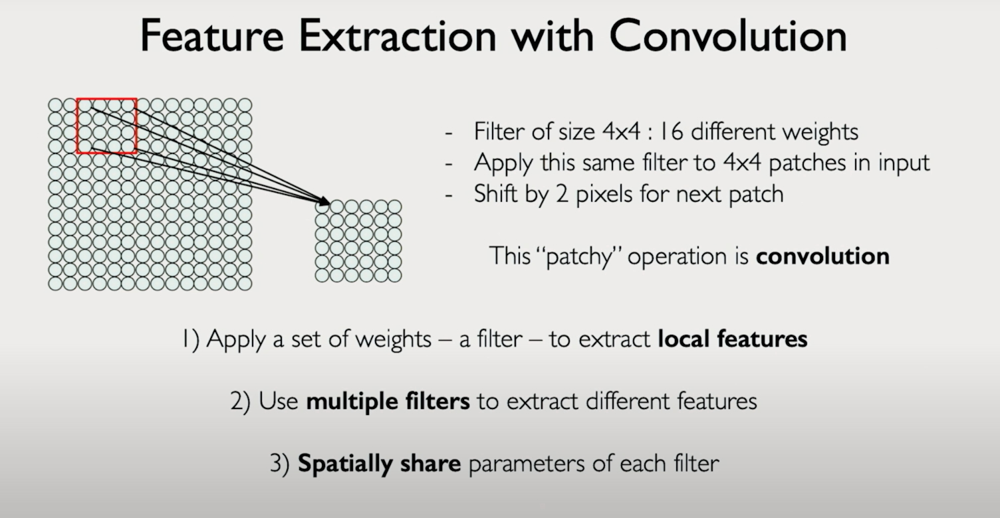

🧠 **GenAI Byte #3: CNNs - Thinking Locally, Seeing Patterns! 🔍**

Hey Learners! 👋

In Byte #2, we saw the challenge: images have huge variability (like a suspect in disguise!). Relying only on raw pixel values is like a rookie detective easily fooled. We need models that act like *trained detectives*, focusing on key features.

**So, why not use the standard Neural Networks (Fully Connected Networks - FCNs) we know?**

Bad idea for images! 🙅‍♀️ The transcript highlights two big problems:

1.  **Flattening Destroys Information:** FCNs need a 1D input (a single list of numbers). To feed an image (a 2D grid), we'd have to **flatten** it – like taking a map and shredding it into one long strip. All the crucial **spatial information** (what's next to what, shapes, structures) gets completely lost! 
   
2.  **Parameter Explosion:** In an FCN, *every* pixel would connect to *every* neuron in the next layer. For images, this means an insane number of connections (parameters)! It's computationally expensive and inefficient. 💸

**CNNs to the Rescue: Leveraging Spatial Structure!** ✨

Instead of flattening, CNNs smartly preserve the image's 2D grid structure. The key idea highlighted in the transcript? **Local Connectivity!**

Instead of connecting everything to everything, neurons only connect to a small, **local patch** of pixels in the input layer.

**How? Meet the Convolution & the Filter!** 💡

This local processing happens via a mathematical operation called **Convolution**. Think of it like using a small "window" or **Filter** (also called a Kernel).

**Analogy Time! The Feature Detector Tool 🔦**

Imagine you have a set of specialized detector tools:
*   One tool is designed *only* to find **vertical edges** (|).
*   Another tool *only* finds **horizontal edges** (—).
*   Maybe another finds **sharp corners** ( L ).

A CNN Filter is like one of these specialized tools! It's a small grid of weights (e.g., 3x3 or 4x4).

**How it Works (Simplified):**

1.  **Slide:** This small filter **slides** across the entire image, step-by-step.
2.  **Look Locally:** At each position, the filter looks only at the small patch of the image directly underneath it.
3.  **Calculate Match:** It performs a calculation (element-wise multiplication & sum) between its own weights and the image patch pixels. This essentially checks "how much does this image patch look like the feature I'm designed to detect?".
4.  **Output:** The result of this calculation becomes a single value in an output "feature map," indicating the presence/strength of that specific feature at that location.

Crucially, the **same filter** (e.g., the "vertical edge detector") is used across the *entire* image. This makes CNNs efficient and allows them to find the same feature regardless of where it appears!

**Key Takeaway:**
CNNs overcome the limitations of FCNs for images by using **convolutional filters** to process images **locally**. This preserves vital spatial information and allows the network to efficiently learn and detect basic patterns (like edges, corners, textures) across the image.

🔗 Watch this [video](https://drive.google.com/file/d/1-EzM1EKFmdXyEBaf2zBz2egFYwfi4Hze/view?usp=sharing) to learn more about image convolution and feature extraction.

**Next Up:** What kinds of features do these filters actually learn? And how do layers of convolutions build up complex understanding? Stay tuned! 🤔