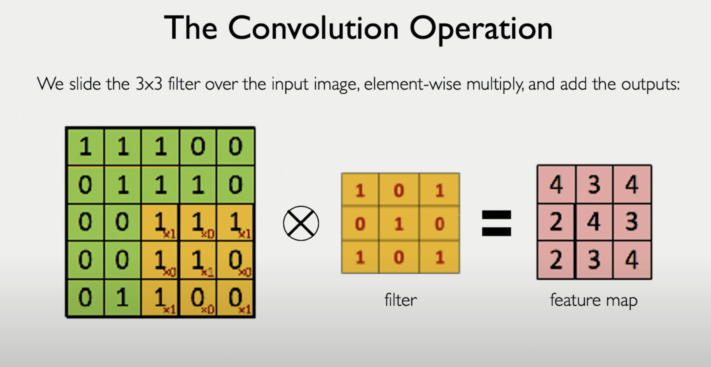

🧠 **GenAI Byte CNN #4: Learned Filters & The Convolution Scan 🛠️➡️🗺️**

**Recap & Context:** Byte #3 introduced **Convolutional Filters** as learnable "Feature Detector Tools" 🔦 that focus on local image regions, overcoming the limitations of Flattening/Fully Connected networks. The short transcript for today hinted that these filters themselves are key inputs we need to define.

**Defining the Filters: They are Learned!**
As established, CNN filters are not manually designed. They consist of **learnable weights**, optimized during training. The network discovers the most useful patterns (edges, corners, textures, etc.) for the task and encodes them into these filter weights. (Think of the detective learning to shape tools in the academy analogy).

**Applying the Learned Filter: The Convolution Operation Explained**
Crucially, understanding *what* a filter is (learned weights) requires understanding *how* it's used. This happens via the **Convolution Operation**:

1.  **Input:** We have the input image (or the feature map from a previous layer) represented as a grid of numbers.
2.  **The Learned Filter:** We have our filter (e.g., a 3x3 grid of learned weights) – let's say it has learned to detect horizontal edges.
3.  **Sliding Window:** The filter is positioned at the top-left corner of the input image, covering a small **patch** of pixels (e.g., 3x3).
4.  **Element-wise Computation:** A dot product is performed between the filter weights and the corresponding image pixel values in the patch underneath it (multiply each filter weight by the pixel value it overlaps, then sum all the results). An optional bias term is often added.
5.  **Output Neuron (Feature Map Value):** This single computed value represents the filter's response at that specific location. It indicates the presence and strength of the feature (e.g., a horizontal edge) in that patch. This value becomes the *first* entry in the **Output Feature Map**.
6.  **Stride & Repeat:** The filter then **slides** horizontally across the image by a defined step size (called the **stride**, often 1 or 2 pixels). Steps 3-5 are repeated for this new patch location, generating the next value in the feature map.
7.  **Full Scan:** This sliding process continues across the entire width and height of the input image, filling the output feature map grid.

The resulting **Feature Map** is essentially a spatial map highlighting where the specific feature detected by that particular learned filter is located in the input.

**Analogy Link:** The detective, having *learned* how to make a perfect "horizontal line detector" tool 🔧 in the academy, now systematically *uses* that tool by sliding it across the entire "crime scene" (image) 🗺️, marking down on a new map wherever strong horizontal lines are found.

**Key Takeaway:**
The power of CNNs comes from both **learning** relevant filters (feature detectors) and **applying** them across the entire input using the **convolution operation** (sliding window over patches). This process generates **feature maps** that preserve spatial information while highlighting the presence of specific learned patterns.

Watch this short MIT lecture [video](https://drive.google.com/file/d/1X2NSMZZhuj38BGDD69435HpdXJctA9O8/view?usp=sharing) to learn more about the convolution operation and feature maps.

**Next Up:** What happens when we stack multiple convolutional layers? Building hierarchical representations! Stay tuned! 

