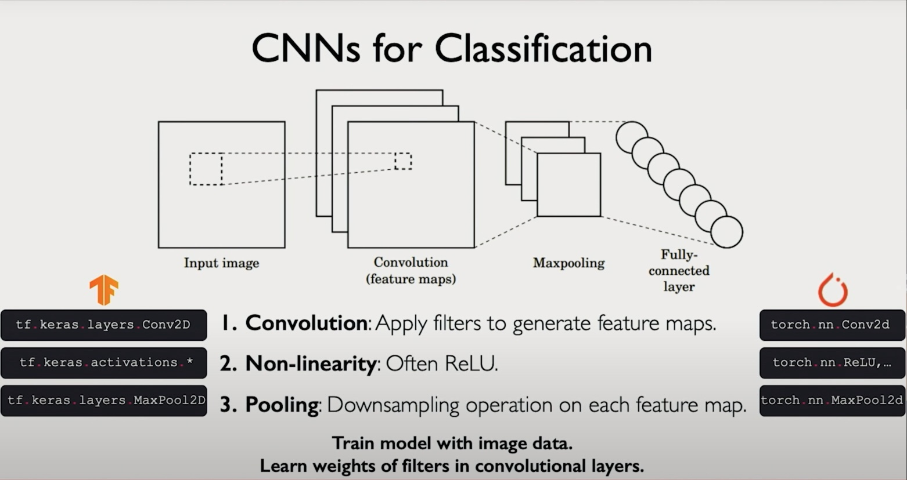

🧠 **GenAI Byte CNN #5: The Three Pillars of CNNs: Convolution, Nonlinearity, and Pooling 🔄✨**

**Recap & Context:** Byte #4 introduced us to learned filters as the building blocks of CNNs, showing how they act as trainable feature detectors that scan across images. Today's byte reveals that these filters are just one part of a three-piece orchestra that makes CNNs work. Let's explore how convolutions work together with two other critical operations to create a powerful image understanding system.

**The Magic Trio of CNNs 🏗️**

1. **Convolutions** (The Detective) 🔍
   - Learned filters scan the image
   - Each filter hunts for specific patterns
   - Creates feature maps: "Where did I find what?"
   - Local focus: only looks at small patches at a time

2. **Nonlinearities** (The Gatekeeper) ⚡
   - ReLU: The bouncer at the club
   - Simple rule: "Positive? Come in! Negative? You're out!"
   - Why? Makes the network more expressive
   - Without it, stacked convolutions would just be one big convolution

3. **Pooling** (The Zoom-Out Lens) 📊
   - Downsamples the feature maps
   - Most common: Max Pooling
     - Takes a 2x2 patch
     - Picks the strongest signal (maximum value)
     - "If there's an edge here, I want to know the strongest part!"
   - Alternative: Mean Pooling
     - Takes the average instead
     - More stable for learning (gradients flow better)
     - "What's the general activity in this region?"

**The Photography Analogy 📸**
Imagine a photographer working on a massive landscape photo:
- **Convolution** = Using different lens filters to highlight features
- **ReLU** = "Keep the bright spots, ignore the dark ones"
- **Pooling** = Stepping back to see the bigger picture
  - Max Pooling = Focusing on the brightest spots
  - Mean Pooling = Capturing the average mood

**Why This Works Together:**
1. **Layer 1:** Find basic patterns
   - Convolution finds edges
   - ReLU keeps strong signals
   - Pooling zooms out

2. **Layer 2:** See bigger patterns
   - Now working with a broader view
   - Can detect more complex shapes
   - Building hierarchical understanding



**Key Takeaway:**
CNNs are like a team of specialists: The Detective (Convolution) finds patterns, the Gatekeeper (ReLU) decides what's important, and the Zoom-Out Lens (Pooling) helps see the bigger picture. Together, they turn pixels into understanding! 🎯

**Sneak Peek: A CNN in Action! 🎬**
Here's how our three operations stack up in a real CNN (don't worry about the details yet!):
```
        Input Image (e.g., 32×32×3)
                  │
            ┌─────┴─────┐
        Conv Layer 1 (32 filters, 3×3)
            Output: 32×32×32
                  │
                ReLU
                  │
              Max Pooling
            Output: 16×16×32
                  │
            ┌─────┴─────┐
        Conv Layer 2 (64 filters, 3×3)
            Output: 16×16×64
                  │
                ReLU
                  │
              Max Pooling
            Output: 8×8×64
                  │
            ┌─────┴─────┐
        Conv Layer 3 (128 filters, 3×3)
            Output: 8×8×128
                  │
                ReLU
                  │
              Max Pooling
            Output: 4×4×128
                  │
              Flatten
            Output: 2048 units
                  │
           Fully Connected Layer
               (e.g., 128 units)
                  │
                ReLU
                  │
           Fully Connected Layer
               (e.g., 10 units)
                  │
               Softmax
                  │
               Prediction
```
See how our three operations repeat in layers? Each layer:
1. Detects features (Convolution)
2. Makes decisions (ReLU)
3. Zooms out (Pooling)

And at the end? That's where classification happens (but that's a story for next byte! 😉)

Watch this short MIT lecture [video](https://drive.google.com/file/d/1TuVd9cPTxWOPGEZFUkdwYH7Arz9dgRJy/view?usp=sharing) to learn more about the three pillars of CNNs.

**Next Up:** Peek inside the CNN's "brain"! We'll visualize what our filters actually learn and see how they transform from simple edge detectors to complex feature recognizers. Plus, we'll discover how these learned features lead to final classifications through those mysterious "Fully Connected" layers! 🔍🧩