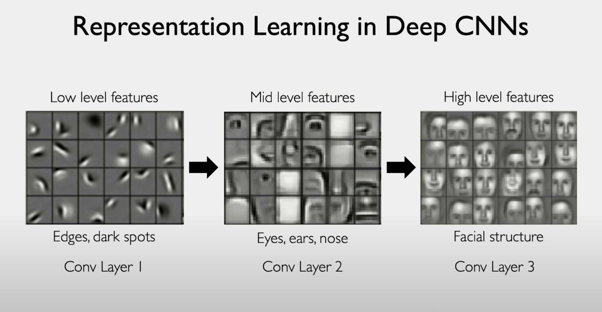
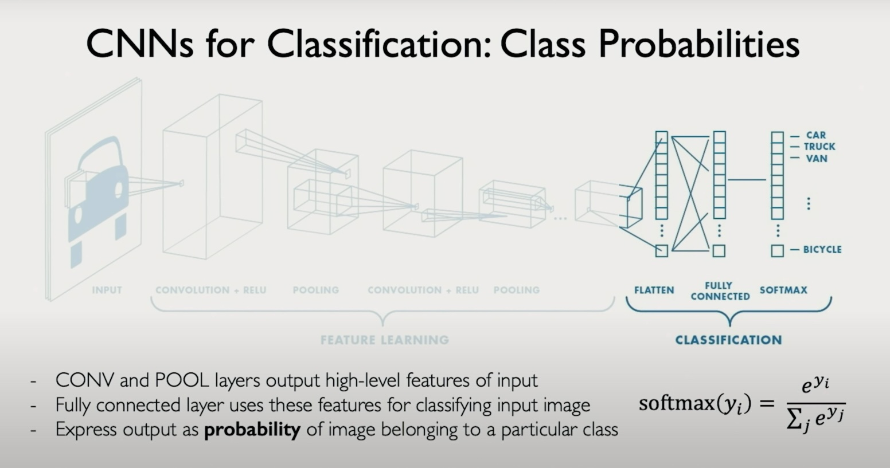

🧠 **GenAI Byte CNN #6: The Two Phases of CNNs: From Features to Decisions 🔍➡️🎯**

**Recap & Context:** Byte #5 introduced us to the three pillars of CNNs: convolution, nonlinearity, and pooling. Today, we'll discover how these operations are organized into a powerful two-phase system that transforms raw pixels into meaningful decisions. Let's peek inside a CNN's "brain" to see how it all works together!

**The Journey of Understanding 🎨**
Just like humans learn to recognize objects, CNNs build their understanding in layers. Let's see how:

1. **Layer 1: Edge Hunters** 📏
   - Learns basic edge detectors
   - Different filters for different directions
   - "I see lines, lots of lines!"
   - Changes in intensity values are key

2. **Layer 2: Feature Composers** 👁️
   - Combines basic edges into meaningful parts
   - Starts recognizing facial features
   - "Hey, that looks like an eye!"
   - Learns noses, ears, and other components

3. **Layer 3: Pattern Masters** 👤
   - Assembles features into full structures
   - Recognizes complete face patterns
   - "Now I see the whole face!"
   - Hierarchical understanding emerges



But here's the interesting part: this learning process naturally splits into two distinct phases - first learning to see features, then learning to make decisions about what was seen.

**The Two-Phase Process: How CNNs Actually Work 🔄**

1. **Feature Extraction Phase** 🔍
   - This is where all those layers we just saw work together
   - Stacked convolution layers build understanding
   - Each layer contributes its piece:
     * Layer 1: "I found edges!"
     * Layer 2: "These edges make features!"
     * Layer 3: "The features form patterns!"
   - All learned automatically from data!

2. **Classification Phase** 🎯
   - Takes all those discovered features
   - Flattens the spatial information (like laying out puzzle pieces)
   - Connects everything through fully connected layers
   - Makes the final decision: "I'm 95% sure this is a face!"



**Important Implementation Notes! 📝**
1. **Learning from Data:**
   - No manual filter design needed
   - Network learns what's important
   - Only guided by the task (e.g., "find faces")
   - Adapts to what works best

2. **Training Considerations:**
   - Models learn exactly what they see
   - Train on upright faces → struggles with sideways faces
   - Need diverse training data for robust recognition

**Code Sneak Peek! 💻**
Here's how these two phases look in PyTorch:
```python
# Feature Extraction Phase
model = nn.Sequential(
    # Layer 1: 32 feature maps
    nn.Conv2d(3, 32, kernel_size=3),
    nn.ReLU(),
    nn.MaxPool2d(2),
    
    # Layer 2: 64 feature maps
    nn.Conv2d(32, 64, kernel_size=3),
    nn.ReLU(),
    nn.MaxPool2d(2),
    
    # Bridge between phases
    nn.Flatten(),  # Prepare features for classification
    
    # Classification Phase
    nn.Linear(64 * spatial_dim, 128),
    nn.ReLU(),
    nn.Linear(128, num_classes),
    nn.Softmax(dim=1)  # Final decision with confidence
)
```

**Key Takeaway:**
CNNs mirror human learning: first they learn to see (Feature Extraction), then they learn to decide (Classification). The magic? Both phases work together seamlessly, learning their roles entirely from data! 🎨✨

Watch this short MIT lecture [video](https://drive.google.com/file/d/133qFYRsZpweQzRc2IpB0IdZ1DA05N1we/view?usp=sharing) to learn more about the two phases of CNNs.

**Next Up:** Beyond Classification! 🚀 While we've seen how CNNs handle classification tasks, these networks can do so much more. Get ready to explore object detection, segmentation, and other exciting applications where CNNs shine! From finding taxis in street scenes to helping radiologists with medical diagnoses, the possibilities are endless! 🎯🔍 