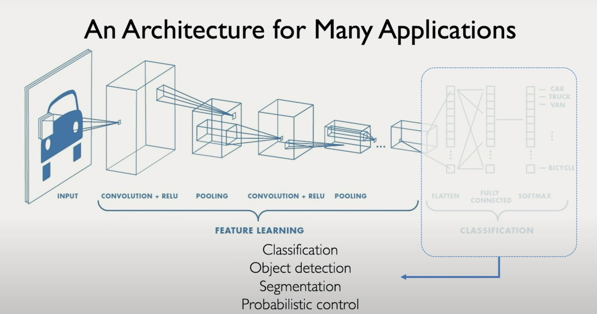
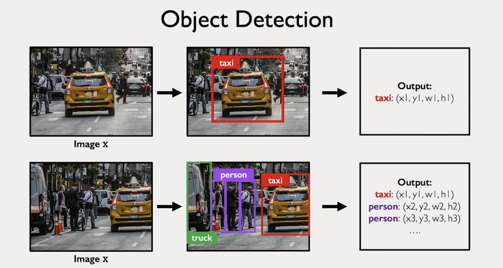
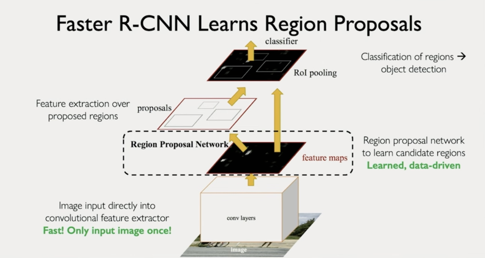

🧠 **GenAI Byte CNN #7: CNNs Beyond Classification - Object Detection 🔍📦**

**Recap & Context:** Byte #6 explained the two phases of CNNs: Feature Extraction and Classification. We saw how CNNs learn features and then use them to make decisions (like identifying a face). But what if we want to do more than just classify an image? Today, we explore how the same powerful feature extractor can be used for different tasks, starting with Object Detection!

**The CNN Swiss Army Knife 🇨🇭🔪**
Remember our two-phase CNN? 
1. **Feature Extractor:** Learns to see patterns (edges, textures, parts).
2. **Head:** Makes decisions based on features.

The magic is that we can keep the *same* Feature Extractor (Phase 1) and just swap out the *Head* (Phase 2) for different tasks!

**From Classification to Detection 🎯**
- **Classification:** "Is there a taxi in this image?" (Yes/No or Class Label)
- **Object Detection:** "*Where* is the taxi in this image, and what is its *exact* boundary?"

Object detection needs to predict:
1.  **Class Label:** What is the object (e.g., taxi, person)?
2.  **Bounding Box:** A rectangle (x, y, width, height) precisely locating the object.
3.  **Confidence Score:** How sure is the model?

**The Challenge: Finding Needles in a Haystack 🌾**
Detecting objects is harder than classifying the whole image because:
- **Multiple Objects:** There could be many objects of different classes.
- **Variable Locations:** Objects can be anywhere.
- **Variable Sizes:** Objects can be big or small.
- **Variable Count:** There might be one taxi or ten (or zero!). The output isn't fixed.

**How Do We Find the Boxes? 🤔**
1.  **Naive Idea (Sliding Windows/Random Boxes):** Try *tons* of boxes all over the image, classify each box. **Problem:** Extremely slow and inefficient!
2.  **Smarter Idea (Selective Search/Heuristics):** Use simpler methods to propose *potential* regions of interest first, then classify those. **Problem:** Better, but still slow, and the box proposer is separate from the classifier (they don't learn together).
3.  **Modern Approach (e.g., R-CNN, Faster R-CNN, YOLO):** Integrate the box proposal *into* the CNN! 
    - **Region Proposal Network (RPN):** A small network *shares features* with the main CNN to predict potential box locations and sizes.
    - **Classification/Regression Head:** Takes proposed regions, classifies them, and refines the bounding box coordinates.
    - **Benefit:** End-to-end learning! The network learns *how* to propose good boxes *and* classify them simultaneously. Much faster and more accurate.

**The Detective Analogy Revisited 🕵️‍♂️**
- **Classification:** The detective looks at the whole crime scene photo and says, "Aha! A clue is present."
- **Object Detection:** The detective not only identifies *multiple* clues but also draws precise chalk outlines around each one.

**Key Takeaway:**
By swapping the classification head for an object detection head (which often includes region proposal), CNNs can move beyond simple image labels to precisely locate and identify multiple objects within an image. The key is often integrating region proposal and classification using shared features for efficiency and accuracy. 📦✅

Watch this short MIT lecture [video](https://drive.google.com/file/d/1b1X2S_0bBcLSIuZat145WoVuBavFzPO0/view?usp=share_link) to learn more about Object Detection with CNNs.

**Next Up:** Going even finer! What if we want to classify *every single pixel* in the image? Get ready for Semantic Segmentation! 🎨🖌️ 