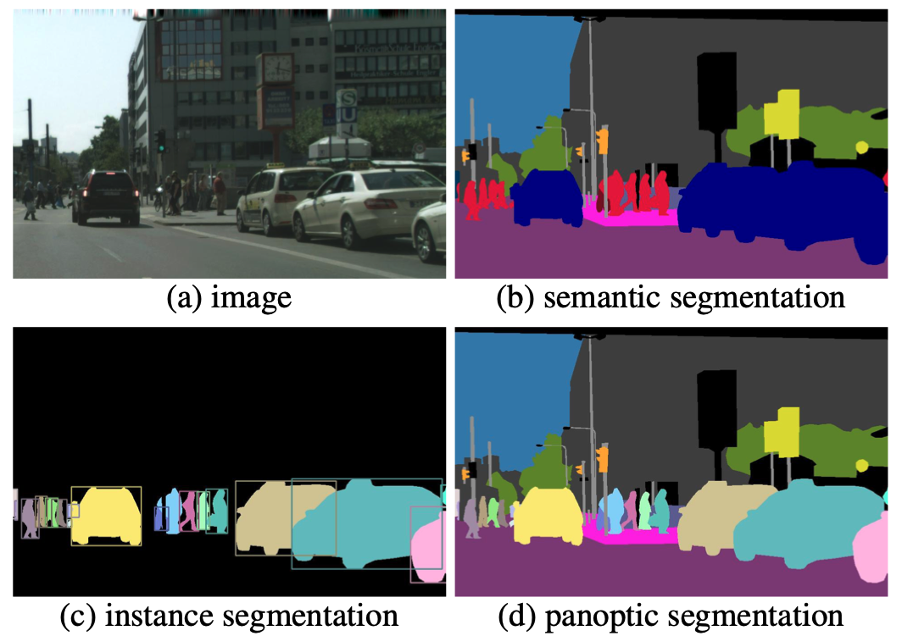
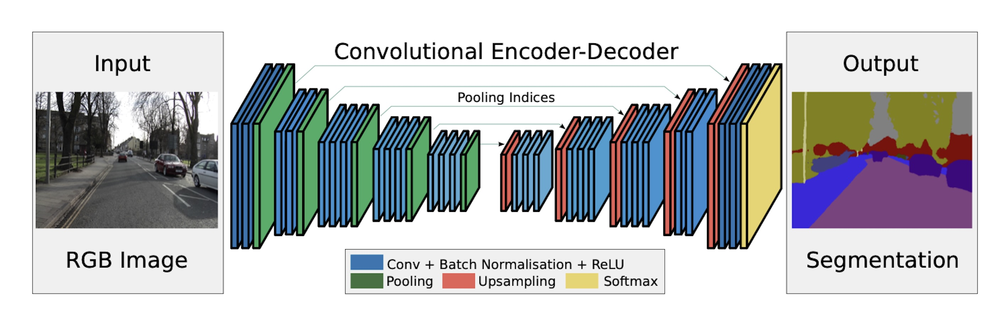

🧠 **GenAI Byte CNN #8: Pixel-Perfect Vision - Image Segmentation 🎨🖌️**

**Recap & Context:** Byte #7 showed how CNNs can perform Object Detection by adding a specialized head to the feature extractor, allowing them to draw bounding boxes around objects. But what if we need even more detail? Today, we explore Image Segmentation, where CNNs learn to classify *every single pixel* in an image!

**Beyond Boxes: Understanding the Whole Scene ✨**
- **Classification:** "This image contains cars and pedestrians."
- **Object Detection:** "*This box* contains a car, *that box* contains a person."
- **Segmentation:** "*These pixels* are car, *these pixels* are road, *these pixels* are sidewalk, *these pixels* are person."

Image Segmentation assigns a label to each individual pixel, creating a detailed map of the scene. But there are actually three main types of segmentation, each with its own approach and applications:

**The Segmentation Family: Three Levels of Understanding 🌟**

**1. Semantic Segmentation:**
   - **What it does:** Groups pixels by class (all "car" pixels get the same color)
   - **Output:** A single mask where each pixel has a class label (car, person, road, etc.)
   - **Limitations:** Doesn't distinguish between instances (can't tell car #1 from car #2)
   - **Key architectures:**
      - **FCN (Fully Convolutional Networks):** Pioneered the approach of replacing fully connected layers with convolutional layers to preserve spatial information
      - **U-Net:** Uses a symmetric encoder-decoder design with skip connections (we'll explore this in depth below)
      - **DeepLab:** Employs dilated/atrous convolutions and multi-scale processing via ASPP (Atrous Spatial Pyramid Pooling)
      - **PSPNet:** Uses pyramid pooling module to capture context at different scales

**2. Instance Segmentation:**
   - **What it does:** Distinguishes individual objects (car #1 vs. car #2 vs. car #3)
   - **Output:** Multiple masks, one for each object instance
   - **Limitations:** Often focuses only on foreground objects, not background
   - **Key architectures:**
      - **Mask R-CNN:** Extends Faster R-CNN (object detection) by adding a branch for predicting segmentation masks for each instance
      - **YOLACT:** Real-time instance segmentation that generates prototype masks and predicts per-instance coefficients
      - **PointRend:** Treats mask prediction as a rendering problem, focusing computation on boundary points

**3. Panoptic Segmentation:**
   - **What it does:** Combines semantic and instance segmentation
   - **Output:** A unified segmentation where every pixel has both a class label and instance ID (if applicable)
   - **Advantages:** Complete scene understanding with both "stuff" (road, sky) and "things" (cars, people)
   - **Key architectures:**
      - **Panoptic FPN:** Extends Feature Pyramid Network with semantic segmentation head alongside instance segmentation
      - **UPSNet:** Unified Panoptic Segmentation Network that jointly handles both tasks
      - **Panoptic DeepLab:** Uses separate decoders for semantic and instance segmentation, then merges results

In our street scene example:
- **Original Image (a):** A typical urban street with cars, pedestrians, buildings, traffic lights, etc.
- **Semantic Segmentation (b):** Each class has its own color (blue for cars, pink for people, green for vegetation, etc.).
- **Instance Segmentation (c):** Each individual object gets a unique color/outline, but background isn't classified.
- **Panoptic Segmentation (d):** Combines both approaches - maintains class colors while differentiating individual instances.

This perfectly illustrates why segmentation is critical for autonomous driving - the vehicle needs to understand not just *what* is in the scene, but precisely *where* everything is at the pixel level!

**Common Challenge: Preserving Spatial Detail 🗺️**
All segmentation approaches face the same core challenge: standard CNNs (via pooling) reduce spatial resolution to capture high-level features, but segmentation needs to preserve pixel-level detail.

**The Encoder-Decoder Solution 🏗️**
The most common solution is some form of encoder-decoder architecture:

1.  **Encoder (Downsampling Path):**
    - Captures high-level semantic information
    - Uses convolutions and pooling to extract features
    - Gradually reduces spatial resolution (like creating a summary)

2.  **Decoder (Upsampling Path):**
    - Recovers spatial detail
    - Uses upsampling methods (transposed convolutions, bilinear upsampling)
    - Gradually increases resolution to produce a full-sized segmentation map
    - Often uses **skip connections** to restore fine details from earlier layers

**Spotlight: U-Net Architecture**
U-Net exemplifies the encoder-decoder approach:
- Symmetric design (encoder and decoder mirror each other)
- Extensive skip connections at each resolution level
- Originally designed for biomedical image segmentation
- Now widely used across domains for its effectiveness and simplicity

**Special Techniques That Make Segmentation Work:**
1. **Skip Connections:** Preserve fine details by connecting encoder layers to corresponding decoder layers
2. **Dilated/Atrous Convolutions:** Increase receptive field without losing resolution
3. **Spatial Pyramid Pooling:** Capture multi-scale context to handle objects of different sizes
4. **Feature Pyramid Networks:** Process and combine features at multiple resolutions

**The Coloring Book Analogy 🖍️**
- **Semantic Segmentation:** Coloring objects by category (all cars blue, all people red)
- **Instance Segmentation:** Giving each person/car their own unique color
- **Panoptic Segmentation:** Coloring by category but using slightly different shades for each individual

**Real-World Applications 🌎**
1. **Autonomous Vehicles:** Distinguishing roads, sidewalks, other vehicles, pedestrians, traffic signs
2. **Medical Imaging:** Identifying tumors, organs, and tissues in MRIs and CT scans
3. **Satellite Imagery:** Mapping forests, urban areas, crops, and disaster zones
4. **E-commerce:** Enabling virtual try-on and background removal
5. **Manufacturing:** Spotting defects in products on assembly lines

**Behind the Scenes: Training Details 🧠**
- **Loss Functions:** Different types need different loss functions (Cross-entropy for semantic, additional mask losses for instance)
- **Data Augmentation:** Random transforms help the model learn better
- **Evaluation:** Models are judged by metrics like Mean IoU, Mask AP (Average Precision), and PQ (Panoptic Quality)

**The Latest Frontier:** Vision Transformers are now challenging CNNs for segmentation tasks, using attention mechanisms instead of convolutions to achieve even better results.

**Key Takeaway:**
Image Segmentation comes in three flavors (semantic, instance, panoptic), each with specialized architectures that build on the same core idea: an encoder captures what's in the scene, while a decoder reconstructs where everything is at the pixel level. This technology enables numerous applications, with autonomous driving being one of the most impactful - helping vehicles "see" and understand their environment in remarkable detail. 🗺️✅

**Next Up:** Can CNNs predict continuous values? We'll look at regression tasks and see how CNNs can learn to steer autonomous vehicles! 🚗💨 