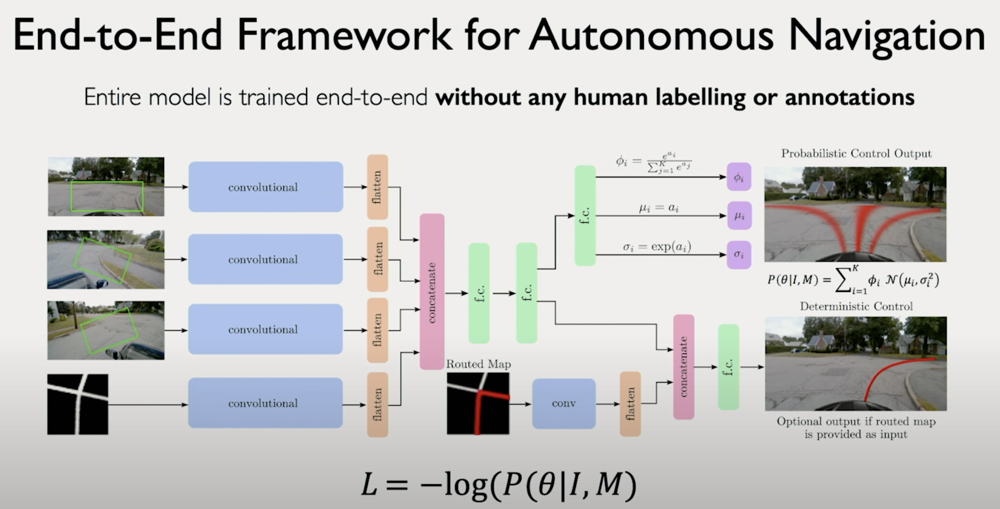

🧠 **GenAI Byte CNN #9: Beyond Pixels - Regression & The Power of CNNs 🚗💨**

**Recap & Context:** Byte #8 introduced us to Image Segmentation, where CNNs classify every pixel in an image using three approaches: semantic (grouping by class), instance (separating individual objects), and panoptic (combining both). Today, we explore another frontier: Regression! Can CNNs predict continuous values, like steering angles for self-driving cars? We'll also summarize the incredible versatility of the CNN architecture.

**Predicting Continuous Values: Regression 📈**
So far, our outputs have been *classes* (cow, taxi, sky) or *locations* (bounding boxes, segmentation masks). But what if we need to predict a *continuous number*?
- **Example:** Predicting the steering angle for an autonomous vehicle based on camera input.
- **Example:** Estimating the age of a person from a face photo.
- **Example:** Predicting the price of a house from satellite imagery.

This is called **Regression**. Instead of discrete classes, the output is a real-valued number (or multiple numbers).

**CNNs for Regression: The Autonomous Driving Case 🤖🚗**
How can a CNN learn to steer a car?
1.  **Input:** Raw camera data (what the car "sees") + optional map data.
2.  **Feature Extraction:** Pass inputs through standard CNN layers (convolution, ReLU, pooling) to extract relevant features.
    - Multiple inputs (camera, map) can have their own feature extractors, and the features are then combined.
3.  **Regression Head:**
    - Flatten the final features.
    - Pass through one or more Fully Connected layers.
    - **Crucially:** The *final layer* does **NOT** use an activation like Softmax (which is for probabilities summing to 1). It outputs the raw numerical value(s) directly (e.g., the steering angle).
    - It might even predict a full *probability distribution* over continuous values, capturing uncertainty.

**Training:** The network learns by comparing its predicted steering angle to the actual angle driven by a human (or expert system) in the training data, adjusting its weights via backpropagation to minimize the error.

**The Driving School Analogy 🚦**
- **Feature Extractor:** The student driver learning to spot important cues (lane lines, traffic lights, pedestrians, road curvature).
- **Regression Head:** Translating those visual cues into a precise steering wheel adjustment.

**Connecting the Dots:** In modern autonomous driving systems, CNNs often perform image segmentation first to understand the scene, then use that information (along with other inputs) to make continuous driving decisions (regression) like steering, acceleration, and braking.

**Series Summary: The Magic of CNNs ✨**
Across these Bytes, we've seen the power and flexibility of CNNs:
1.  **Learned Filters:** They automatically discover relevant patterns (Byte #4).
2.  **Core Operations:** Convolution, Nonlinearity, Pooling work together (Byte #5).
3.  **Hierarchical Features:** Build understanding from simple edges to complex objects (Byte #6).
4.  **Versatile Architecture:** The same feature extractor backbone can be paired with different heads for various tasks:
    - **Classification:** Identifying image content (Byte #6).
    - **Object Detection:** Locating and classifying objects (Byte #7).
    - **Image Segmentation:** Classifying every pixel (Byte #8).
    - **Regression:** Predicting continuous values (Byte #9).

**The Big Picture:** CNNs provide a powerful, learnable way to extract meaningful information from grid-like data (especially images), forming the foundation for countless modern computer vision applications.

**Key Takeaway:**
CNNs aren't limited to classification! By changing the final layers (the "head") and the loss function, the same core feature extraction principles can be applied to predict continuous values (regression), enabling tasks like autonomous navigation. The fundamental building blocks empower a vast range of applications, from medical diagnostics to self-driving cars. 🚀

Watch this short MIT lecture [video](https://drive.google.com/file/d/1FYUfua5VTMkdp0D75r9vLDS_aPgde--V/view?usp=sharing) to see CNNs applied to autonomous driving.

**Congratulations! 🎉 You've journeyed through the core concepts of Convolutional Neural Networks!** We hope this series made these powerful tools more intuitive and understandable. Keep exploring! 