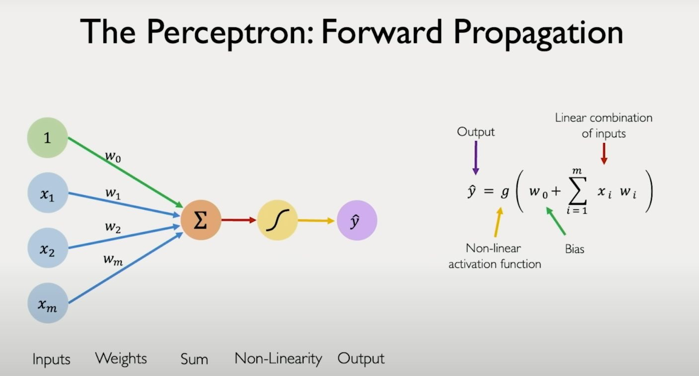
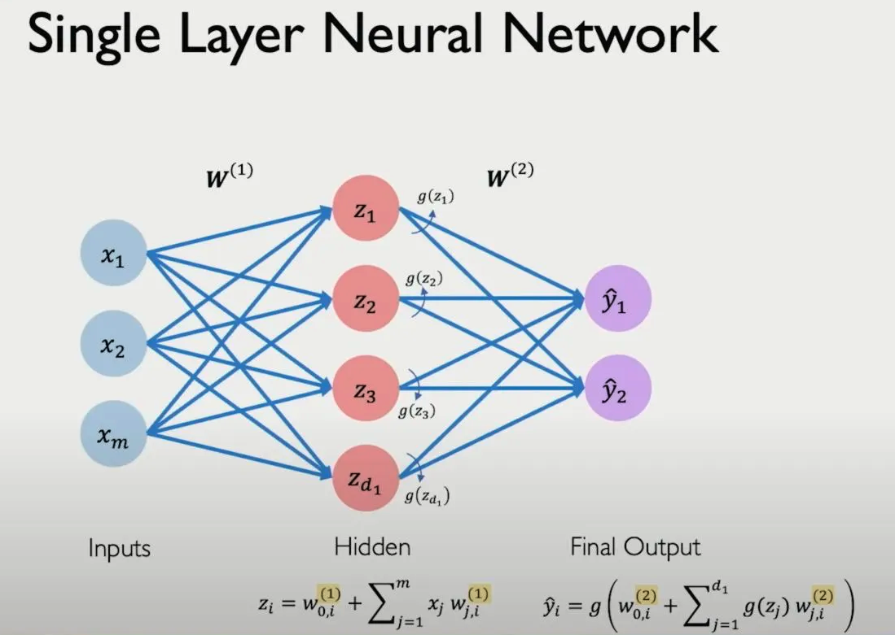
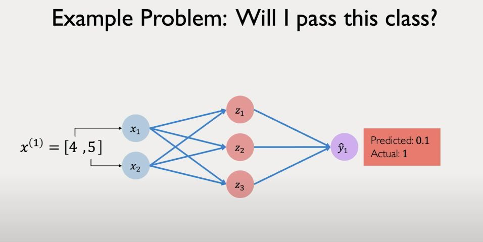
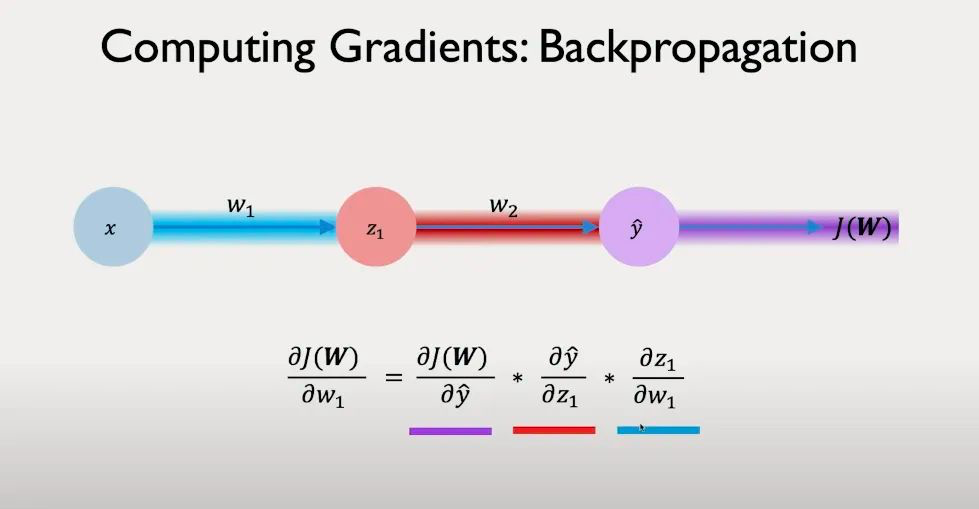
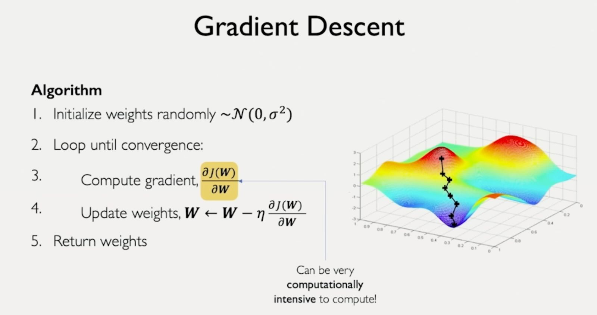
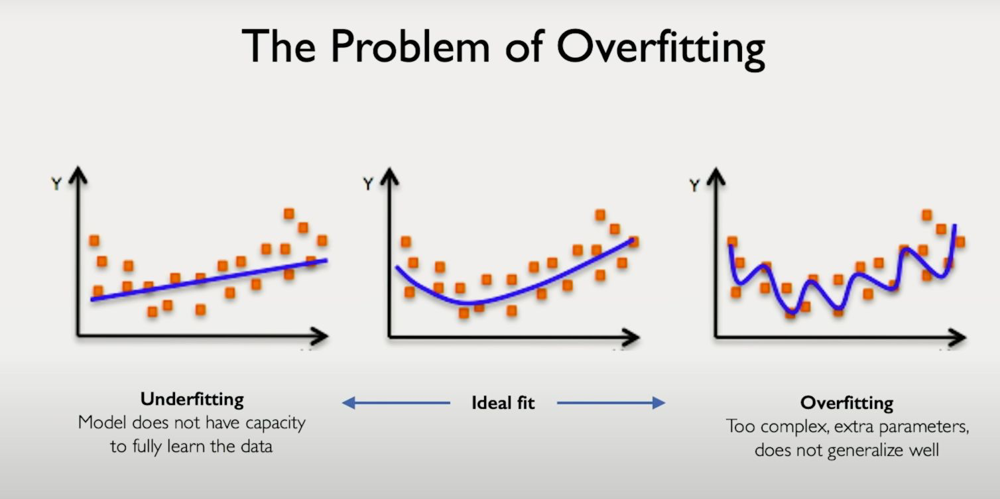
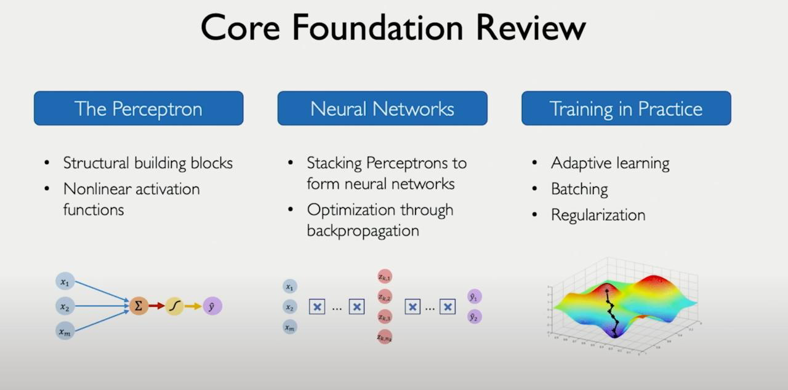
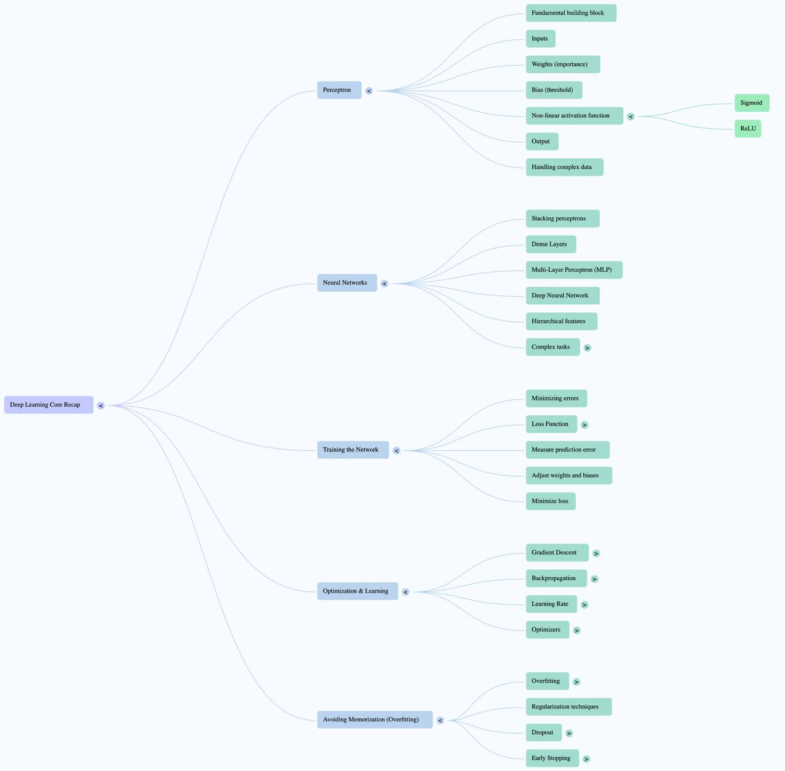

# 🧠 Deep Learning Basics Bytes

This section collects the GenAI Bytes specifically focused on the fundamental concepts of Deep Learning.

Following the core philosophy of **GenAI Bytes**, these entries aim to make complex Deep Learning topics more intuitive by leveraging **simple explanations and relatable analogies**. From the simple perceptron to the mechanics of training complex networks, the goal is to help you build a strong foundational understanding through quick, memorable insights.

## Acknowledgements & Source Inspiration

Many of the initial bytes in this section draw inspiration from, and adapt concepts covered in, the fantastic **MIT Introduction to Deep Learning (6.S191)** course lectures available publicly on YouTube.

*   **Course:** [MIT Introduction to Deep Learning | 6.S191](https://www.youtube.com/watch?v=alfdI7S6wCY&list=PLtBw6njQRU-rwp5__7C0oIVt26ZgjG9NI&index=3)

While our bytes use analogies for quick understanding, the original lectures provide the full, rigorous context. **We encourage you to watch the original lecture** for a complete and in-depth understanding.

---

## Deep Learning Bytes Day wise 💡

Let's do Deep Learning (Intro) refresh! 😉 with our GenAl Byte Series and explore the very foundation of what makes intelligent Al like ChatGPT and advanced Al Agents possible.
These powerful systems are built upon fundamental concepts.
Just imagine, a decade ago, Al facial generation was quite basic, but now we have mind-blowing live voice cloning! 🤩

**🚀 GenAl Byte of the Day #1: The Perceptron—The Structural building block of deep learning!**

Imagine a simple filter in a camera lens: the Perceptron! 📸

- **➡️ Input (Light Rays):** Incoming light represents raw data.
- **➕ Weights (Color Intensity Adjustment):** The filter amplifies or dims certain colors, just like a perceptron assigns importance to inputs.
- **🪙 Bias (Threshold Setting):** Controls how much light needs to be present for an effect to be applied.
- **🧠 Activation Function (Filtering Mechanism):** Instead of simply turning light ON or OFF, the filter smoothly adjusts brightness—like a ReLU (producing non-negative values) or sigmoid function (producing values between 0 and 1) modifying the output.
- **💡 Output (Processed Light):** The final adjusted light intensity, which can be a range of values depending on the activation function used!

This adaptive filter is the building block of deep learning models, just like simple camera filters lead to complex image processing! 🎥🧠✨

A quick 5 min video on Perceptron Intro from MIT [here](https://drive.google.com/file/d/1dbYaQB0rnTQUAiNM0up_K5AwT-fuJ7T1/view?usp=share_link)

---

**🚀 GenAl Byte of the Day #2: Perceptron in Action—From Math to Intelligence!**

Yesterday, we explored the **Perceptron** as the fundamental building block of deep learning. Today, let's **see it in action!**🤩
At its core, a Perceptron applies a **dot product** between inputs and weights, then passes the result through an **activation function** to introduce **non-linearity**—essential for handling real-world data!

**🔢 Example:**
1️⃣ **Compute Dot Product:** Like scoring a test, where each answer (input) is weighted differently.
2️⃣ **Apply Activation Function:** Think of a decision boundary—without activation, the perceptron is just a linear separator!

- **Sigmoid Activation** 📈: Converts values into probabilities (0 to 1), great for binary classification!

🔗 Watch the video to see how a simple Perceptron can make complex decisions! 🎥🧠

[Watch the video](https://drive.google.com/file/d/1SPv1CaMnjNURUk63Y3H533N7RNQDKIze/view?usp=share_link)    

---

**🚀 GenAl Byte of the Day #3: From One to Many—Multiple Perceptrons & Dense Layers!**

Yesterday, we explored how a **single perceptron** processes inputs using weights, bias, and an activation function. But real-world problems are complex, requiring more than one perceptron working together!

- **📈 Scaling Up: Multiple Perceptrons**
    - Instead of a single neuron, we now have **multiple perceptrons**, each learning different patterns from the same input.
    - Each perceptron applies **its own set of weights and bias**, allowing the model to capture richer information.
- **🧱 Dense Layers—Building Intelligence**
    - When multiple perceptrons are **fully connected** to the next layer, we form a **Dense (Fully Connected) Layer**.
    - This layered approach enables deep learning models to handle complex tasks, from image recognition to natural language understanding!

By stacking **multiple layers of perceptrons**, we build the foundation of **Deep Learning**, powering Al systems like LLMs and Al Agents! ✨🚀

👀 Watch the short 2-min video to see how multiple perceptrons work together to extract complex patterns and build intelligence! 🎥

[Watch the video](https://drive.google.com/file/d/11yIXz1TGJJnla3TUFrrFIK7Q-oTTHIxJ/view?usp=sharing)

---

**🚀 GenAl Byte of the Day #4: From a Single Neuron to Deep Learning!**

We started with the **Perceptron**, but real-world Al needs **layers of neurons** to learn complex patterns! 🧠✨

Here's how deep learning builds up step by step:
✅ **Perceptron** → A **single neuron** that applies weights, bias & activation.
✅ **Dense Layer** → A **single layer** of multiple perceptrons, fully connected to the next layer.
✅ **MLP (Multi-Layer Perceptron)** → **Multiple dense layers** stacked together = **Deep Neural Network!**

❓ **Why does this matter?**
A single perceptron can only handle simple patterns, but stacking layers allows Al to **extract deeper features**, **learn non-linear relationships**, and **make powerful decisions**—just like how modern Al systems, including **LLMs and Al Agents**, work! 🚀

🔗 Watch the short video to see how layers unlock deep learning! 🎥

[Watch the video](https://drive.google.com/file/d/1_cl3lTnD3gge7jPzPzMBsfJefL6-oDtS/view?usp=sharing)

---

**🚀 GenAl Byte #5: Applying a Neural Network for Classification**

Let's now apply a **neural network** and understand it with a simple example of **two inputs, one hidden layer with three neurons, and one output.**

Imagine we want to predict **"Will I pass this class?"** based on two inputs:

- **x₁**: Number of lectures attended in a week
- **x₂**: Hours spent on the final project

We'll use a **basic neural network** to estimate the probability of passing based on past student data.

**Neural Network Architecture (example):**
1️⃣ **Input Layer** → Takes in the two features (x₁, x₂).
2️⃣ **Hidden Layer** → Contains 3 hidden neurons, each applying a **weight, bias, and activation function (commonly ReLU)**.
3️⃣ **Output Layer** → A single neuron produces a **logit (raw score)**.
4️⃣ **Activation Function (Sigmoid for Binary Classification)** → Converts the logit into a **probability (range 0 to 1)**.
5️⃣ **Final Decision** → If **probability > 0.5**, classify as **pass (1)**; otherwise, classify as **fail (0)**.

**Binary vs. Multiclass Classification**
♦️ **Binary Classification (Pass/Fail)** → Uses **Sigmoid Activation** to output a probability between **0 and 1**.
♦️ **Multiclass Classification (e.g., Grades: A, B, C, D, F)** → Uses **Softmax Activation** to output probabilities for multiple classes, ensuring they **sum to 1**.

Understanding the Training Process

Initially, the model may predict a **10% pass probability** for a student who actually passed—**because it's untrained!** The goal is to **minimize errors** over multiple iterations using a **loss function**:

- **Binary Classification (Pass/Fail): Binary Cross-Entropy (Log Loss)**
- **Multiclass Classification (Grades A-F): Categorical Cross-Entropy**

By iteratively adjusting weights and biases to reduce loss, the model **improves its accuracy over time** and becomes better at making predictions.
This is how we **apply neural networks**—by training them on real-world data and fine-tuning them step by step! 🚀

🔗 Watch this short video from @MITDeepLearning on “Applying Neural Networks”

[Watch the video](https://drive.google.com/file/d/1B5fjEld4Scf0UvkWOB0E-f6oPXICe3Ce/view?usp=sharing)

---

**🚀 GenAl Byte #6: Training Neural Networks – Loss and Optimization**

Yesterday, we applied a **neural network** for classification. Now, let's explore **how to train it** effectively.
The goal of training is to **minimize the loss**—a measure of how far our predictions are from actual values. This is done by **optimizing the network's weights**.

✔ **Understanding the Process:**
1️⃣ **Loss Function** → Measures prediction error. Examples:

- **Binary Cross-Entropy** (for pass/fail classification)
- **Categorical Cross-Entropy** (for multi-class problems)
2️⃣ **Gradient Descent** → Finds the optimal weights by iteratively moving in the direction that **reduces loss**.
- Computes **gradient** (slope) of the loss function w.r.t weights.
- Updates weights in the **opposite direction** of the gradient to minimize loss.
3️⃣ **Backpropagation** → Uses the **chain rule** to efficiently compute **gradients for all layers** in the network.
- Propagates the loss backward from output to input layers.
- Adjusts weights at each step based on their contribution to error.

By repeating these steps over multiple iterations, the model **gradually improves** and makes better predictions.

[Watch the video](https://drive.google.com/file/d/1gEe5seeDrx040fbP367FVd9t1DMDtOWf/view?usp=sharing)

🔗 Watch this short video from @MITDeepLearning on “Training Neural Networks”

---

**🚀 GenAl Byte - Day #7: Optimization: Smart Driving on the Learning Highway** 🚗💨

Yesterday, we learned that neural networks minimize errors using loss functions. Today, we dive into **optimization**, the process of finding the best network settings, like navigating a complex mountain range (the loss landscape).

The **learning rate** is your **gas pedal**, controlling how big a step you take towards the optimal point.

- Too slow? Tiny steps, might get stuck.
- Too fast? Huge leaps, risk overshooting.

✔ **Smart Navigation Techniques:**

1. **Adaptive Speed Control (Adam):** Think of **Adam** as a smart cruise control that dynamically adjusts your speed (learning rate) based on the terrain. It builds upon the basic idea of taking steps downhill (**gradient descent**) but learns the best step size for each part of the landscape.
2. **Choosing Your Route (Gradient Descent Variations):**
    - **Solo Scout (Stochastic Gradient Descent - SGD):** This is the basic way to move. Imagine a single scout quickly pointing downhill based on one spot. It's simple but can be slow and noisy. **Adam** uses insights from past "scout reports" to make smarter moves.
    - **Small Team (Mini-batch GD):** A small group of scouts gives a more stable direction.
    - **Full Convoy (Full GD):** The whole team surveys, giving the most accurate direction but is very slow.
3. **Highway for Teams (GPUs):** Parallel processing of mini-batches speeds up learning, like having more lanes for our scout teams.

⚡ **Takeaway:** While basic driving (**SGD**) can get you there, using smart cruise control (**Adam**) often makes the journey faster and more efficient by automatically adjusting your speed. Choosing the right "driving" technique is key to successful learning! 🚗💨

🔗 Watch this short video from @MITDeepLearning on “Optimizing Gradient Descent”

[Watch the video](https://drive.google.com/file/d/1JKdHTxqIDRjjIbZPIcoFKmClMR6M41IT/view?usp=sharing)

---

**🚀 GenAl Byte - Day #8: Don't Just Memorize, Learn! (Overfitting Trap)** 🧠≠💾

Yesterday: Models learn via smart driving (optimization). Today: A big trap - **Overfitting!**
This happens when a model gets *too* good on its practice data (training set) by just **memorizing** it, like knowing the *exact* answers to practice questions. But then, it fails on the real exam (test set) with new questions!

🎯 **Goal:** We want models to **Generalize** - learn the underlying concepts, not just memorize examples.

**How? Regularization!** Think of these as smart study habits to prevent memorization:

✔ **Smart Study Habits (Regularization):**

1. **Dropout (Forced Teamwork):**
    - **Analogy:** Imagine studying, but random notes temporarily vanish!
    - **How:** Randomly switches off some "brain cells" (neurons) during each practice round.
    - **Why:** Forces the model to learn backup plans and not rely too heavily on any single "fact" (neuron). Makes it more **robust!** 💪
2. **Early Stopping (Know When Peak Understanding is Reached):**
    - **Analogy:** Checking your score on new practice questions (a validation set) while studying.
    - **How:** Monitor performance on this separate validation set during training.
    - **Why:** Stop training when the score on the validation set starts dropping, even if the score on the training set is still going up. This catches the model at its best general understanding, before it just starts memorizing. 📈📉✅

**In essence:** You train on **Training Data**, tune and make decisions using **Validation Data** (often via Hold-Out or K-Fold CV), and get your final, honest score using the **Test Data**.

✨ **Takeaway:** Success isn't just acing practice! Models need to perform well on NEW, unseen data. Regularization helps them truly **learn** and avoid the overfitting trap. ✨

🔗 Watch this short video from @MITDeepLearning on “Overfitting and Regularization Techniques”

[Watch the video](https://drive.google.com/file/d/1E_8pEU1lr8trqVA7esumpwUcXgYP8Uuh/view?usp=sharing)

---

**🚀 GenAI Byte of the Day #9: Deep Learning Core Recap! 🧠**

Hey team! We've covered some serious ground exploring the foundations of Deep Learning over the past few Bytes (#1-8). Let's quickly recap our journey from a single neuron to training complex networks!

1. **The Perceptron (Byte #1, #2):**
    - We started with the **Perceptron**, the fundamental building block.
    - Think of it like a simple filter: taking **inputs**, applying **weights** (importance) and a **bias** (threshold), then passing the result through a **non-linear activation function** (like Sigmoid or ReLU) to produce an **output**.
    - This non-linearity is key for handling complex, real-world data!
2. **Building Neural Networks (Byte #3, #4):**
    - A single perceptron is limited. By stacking multiple perceptrons, we create **Dense Layers**.
    - Stacking these layers forms a **Multi-Layer Perceptron (MLP)** or a **Deep Neural Network**.
    - This layered structure allows AI to learn hierarchical features and tackle complex tasks (like image recognition or LLMs!).
3. **Training the Network (Byte #5, #6):**
    - How do networks learn? By minimizing errors!
    - We define a **Loss Function** (like Cross-Entropy) to measure how far off the predictions are from the actual values.
    - The goal is to adjust weights and biases to **minimize this loss**.
4. **Optimization & The Learning Journey (Byte #7):**
    - **Gradient Descent** is the core idea: iteratively adjusting weights in the direction that reduces the loss (like walking downhill).
    - **Backpropagation** is the efficient algorithm used to calculate these adjustments (gradients) throughout the network.
    - The **Learning Rate** controls the step size. Optimizers like **Adam** act like "smart cruise control," dynamically adjusting the learning rate for faster and more stable learning.
5. **Avoiding the Memorization Trap (Byte #8):**
    - A major challenge is **Overfitting**: when the model memorizes the training data but fails on new, unseen data.
    - **Regularization** techniques are crucial study habits for models!
        - **Dropout:** Randomly switching off neurons forces the network to be more robust.
        - **Early Stopping:** Monitoring performance on a separate validation set and stopping training before the model starts overfitting.

A quick mindmap to recap the journey!

**Key Takeaway:** We've journeyed from the simple Perceptron to understanding how layers create powerful Neural Networks, how they learn through loss minimization via Gradient Descent and Backpropagation, and how to prevent them from just memorizing using Regularization. These core concepts are the engine behind much of the amazing AI we see today! ✨

Keep learning! 💪